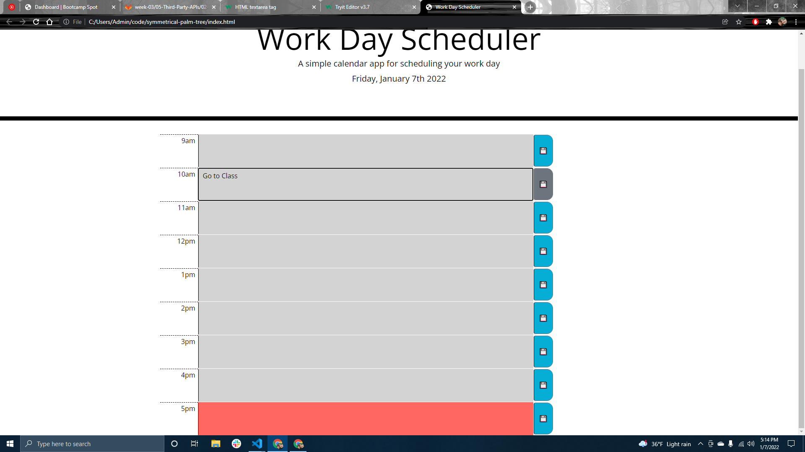

# symmetrical-palm-tree
Creating a simple calendar application that allows a user to save events for each hour of the day by modifying starter code; using my HTML, CSS, jQuery, and JavaScript skills.

I initallty had a hard time stlying the tables, and getting them to match up with the demo in the read me. Once I figured out to use table and got them styled similar to the demo. I then added the current day using moment and added it to a p tag. Then I wrote a 4 loop to change and set the colors based on the time of day, and weather or not it was past the current hour.

Changes made:

GitHub: https://github.com/Acanthodoris/Password-Generator

GitHub Page: https://acanthodoris.github.io/Password-Generator/

Screenshot:

Credits:
https://www.w3schools.com/html/html_tables.asp
https://unicode-table.com/en/1F4BE/
https://stackoverflow.com/questions/507138/how-to-add-a-class-to-a-given-element